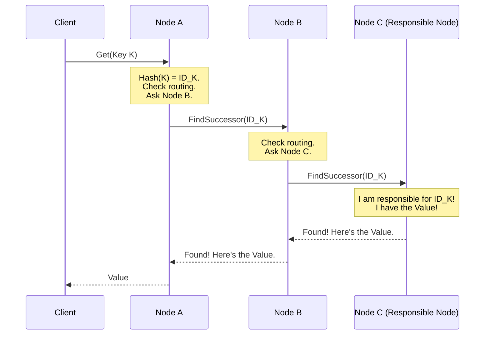

# Chapter 1: What is a Distributed Hash Table (DHT)?

Welcome to the `pikachu` project! We're excited to help you understand the world of distributed systems. In this first chapter, we'll explore the core concept that powers `pikachu`: the **Distributed Hash Table**, or **DHT**.

## The Problem: Storing Lots of Data Together

Imagine you're building a huge online service, maybe like a social network or a file-sharing platform. You need to store tons of information: user profiles, photos, messages, file locations, etc.

A simple approach might be to store everything on one giant, super-powerful computer (a central server).

```mermaid
graph LR
    User1 --> CentralServer[Big Central Server<br>(Stores ALL data)]
    User2 --> CentralServer
    User3 --> CentralServer
```

But what happens if:
1.  **Too much data:** The server runs out of space?
2.  **Too many users:** The server gets overloaded and slows down?
3.  **Server crashes:** The entire service goes offline?

Storing everything in one place creates single points of failure and limits how big your service can grow. We need a better way!

## The Solution: Distribute the Data!

Instead of one giant server, what if we used *many* regular computers (let's call them **nodes**) and spread the data across them? This is the core idea behind a Distributed Hash Table (DHT).

A DHT is a system for storing **key-value pairs**. Think of it like a dictionary or a map in programming:

*   **Key:** A unique name or identifier (like a username, filename, or ID).
*   **Value:** The data associated with that key (like the user's profile information, the content of a file, or where to find a file).

In a DHT, these key-value pairs aren't stored in one place. They are distributed (spread out) across many nodes in a network.

```mermaid
graph LR
    subgraph DHT Network
        NodeA[Node A<br>(Stores some data)]
        NodeB[Node B<br>(Stores other data)]
        NodeC[Node C<br>(Stores more data)]
        NodeD[Node D<br>(...and so on)]
    end
    User1 --> NodeA
    User2 --> NodeC
    User3 --> NodeB

    NodeA --- NodeB
    NodeB --- NodeC
    NodeC --- NodeD
    NodeD --- NodeA
    NodeA --- NodeC # Connections can be more complex
```

**Key Benefits:**

1.  **Scalability:** Need more storage? Just add more nodes to the network!
2.  **Resilience:** If one node crashes, the rest of the network (and most of the data) is usually still available. The system can often recover.
3.  **Efficiency:** Requests can be spread across many nodes, reducing the load on any single one.

**Analogy: The Giant Shared Phonebook**

Imagine a massive phonebook, too big for any single person to hold. Instead, we tear it into sections (like A-C, D-F, G-I, etc.) and give each section to a different person (a node).

Now, if you need to find "Pikachu's" phone number:
*   You don't have the whole book.
*   You don't want to call *everyone* asking if they have the "P" section.

A DHT provides a *clever system* (which we'll explore in later chapters) to efficiently figure out *which person* holds the section containing "Pikachu" without asking everybody. You might ask one person, who points you to another, who points you closer, until you find the right one.

## How a DHT Decides Where Data Goes (The "H" in DHT)

How does the system know which node should store which key-value pair (e.g., which person gets which part of the phonebook)? This is where the **Hash Table** part comes in.

1.  **Hashing:** We use a special function called a "hash function". This function takes the **key** (e.g., "Pikachu") and turns it into a seemingly random, fixed-size number or string (let's call this the **ID**). For example, `hash("Pikachu")` might become `54321`.
2.  **Assigning IDs:** Both the *data keys* and the *nodes* themselves get assigned IDs in the same large range (e.g., numbers from 0 to 99999).
3.  **Responsibility:** The DHT has rules (like the [Chord Protocol & Ring](03_chord_protocol___ring_.md) we'll see later) that determine which node is *responsible* for which range of IDs. A key-value pair is typically stored on the node whose ID is *closest* to the key's ID (according to the DHT's rules).

So, if `hash("Pikachu")` is `54321`, the DHT finds the node responsible for IDs near `54321` and stores the ("Pikachu", "Electric Mouse Pokémon") pair there.

## Using the `pikachu` DHT

In `pikachu`, you interact with the DHT network through individual nodes. You can connect to any participating node to store (put) or retrieve (get) data.

**Storing Data (`put`)**

Let's say you want to store the key `"my_favorite_pokemon"` with the value `"Pikachu"`. You connect to *any* node currently running in the `pikachu` network (e.g., one running on your machine at port `8001`) and use the `put` command:

```bash
cargo run put -p 8001 -k "my_favorite_pokemon" -v "Pikachu"
```

*   `-p 8001`: Specifies the port of the node you're connecting to.
*   `-k "my_favorite_pokemon"`: The key you want to store.
*   `-v "Pikachu"`: The value associated with the key.

**What happens?**
The node at port `8001` receives your request. It calculates the hash of `"my_favorite_pokemon"`. It then uses the DHT's internal logic ([Routing & Data Location (Finger Table / Successor List)](04_routing___data_location__finger_table___successor_list__.md)) to figure out which node in the entire network is responsible for that key's hash. It might be itself, or it might be another node. It ensures the data gets stored on the correct responsible node. You don't need to know *which* node actually stores it!

**Retrieving Data (`get`)**

Later, you (or someone else connected to *any* node in the network, say one at port `8002`) can retrieve the value using the key:

```bash
cargo run get -p 8002 -k "my_favorite_pokemon"
```

*   `-p 8002`: The port of the node you're connecting to this time.
*   `-k "my_favorite_pokemon"`: The key whose value you want.

**What happens?**
The node at port `8002` receives the request. It hashes the key `"my_favorite_pokemon"`. Using the DHT's lookup mechanism ([Recursive Lookup](05_recursive_lookup_.md)), it finds the node responsible for that key's hash across the network. That responsible node sends the value (`"Pikachu"`) back, and eventually, it's returned to you via the node at port `8002`.

```
Value: "Pikachu"
```

The beauty is that you can `put` data by connecting to one node and `get` it back by connecting to a *different* node, and the DHT handles finding the data for you seamlessly.

## Under the Hood: How Finding Data Works (A Simple Look)

When you ask a node (let's call it Node A) to `get` a key, it might not have the data itself. How does it find the node that *does* have it?

The nodes in the DHT maintain pointers or references to other nodes ([Routing & Data Location (Finger Table / Successor List)](04_routing___data_location__finger_table___successor_list__.md)). They use these pointers to ask other nodes that might be "closer" (in terms of ID space) to the node responsible for the key.

Here's a simplified example using a sequence diagram:

1.  You ask Node A to get data for Key K.
2.  Node A calculates `hash(K) = ID_K`. Node A checks its routing info and thinks Node B might be closer to `ID_K`. It forwards the request to Node B.
3.  Node B checks its info. It thinks Node C is responsible for `ID_K`. It forwards the request to Node C.
4.  Node C checks its storage and finds it *is* responsible for `ID_K`! It has the Value.
5.  Node C sends the Value back to Node B (who asked it).
6.  Node B sends the Value back to Node A (who asked it).
7.  Node A sends the Value back to you.



This process of asking node-by-node is a form of **lookup**. `pikachu` uses a specific type called [Recursive Lookup](05_recursive_lookup_.md), which we'll detail in a later chapter. The key idea is that no single node needs to know about *all* other nodes; it just needs to know enough to forward the request in the right general direction.

## Conclusion

You've learned the fundamental concept of a Distributed Hash Table (DHT)! It's a powerful way to build large, scalable, and resilient systems by distributing key-value data across many cooperating computers ([Node](02_node_.md)s). You saw how hashing helps assign data to nodes and how, conceptually, nodes can find data even if they don't store it themselves. We also saw how to use the basic `put` and `get` commands in `pikachu`.

But what exactly *is* a node in this system? How does it store data and communicate with others? Let's dive into that in the next chapter.

**Next:** [Chapter 2: Node](02_node_.md)
