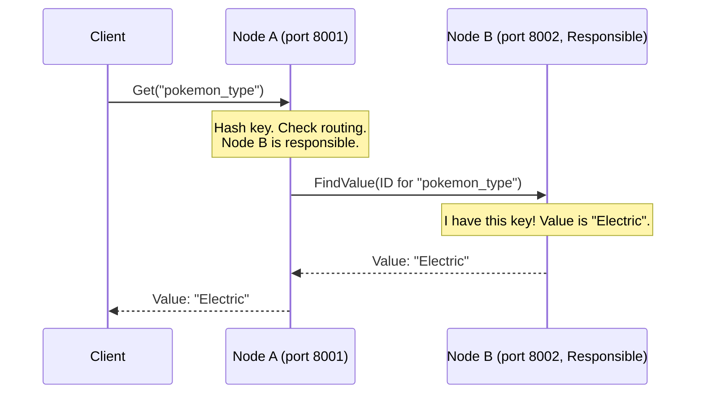

# Chapter 2: Node

Welcome back! In the [previous chapter](01_distributed_hash_table__dht__.md), we learned about the big picture: the **Distributed Hash Table (DHT)**. We saw how a DHT spreads data across many computers instead of storing it all in one place. This makes systems bigger, stronger, and faster.

But what exactly *are* these "many computers"? How does an individual computer participate in this shared system? That's what we'll explore in this chapter: the **Node**.

## The Problem: Being a Participant

Imagine our giant shared phonebook from Chapter 1. We decided to tear it into sections and give each section to a different person. A "Node" is like one of those people.

How does one person (a node) know:
*   Which section of the phonebook (which data) are they responsible for?
*   How to talk to the *other* people (nodes) holding other sections?
*   How to find a phone number if it's not in *their* section?
*   How to join the group if they are new, or leave if they need to?

Understanding the "Node" is key to understanding how the DHT actually works at the ground level.

## What is a Node?

In the `pikachu` DHT (and most DHTs), a **Node** is simply:

> An individual computer or process participating in the Pikachu DHT network.

Think of it as a single running instance of the `pikachu` program. It could be running on your laptop, a server in a data center, or any machine connected to the network.

**Analogy: The Librarian**

Remember the giant, circular library analogy for a DHT? A **Node** is like a single librarian.

*   **Specific Section:** Each librarian is responsible for only a *part* of the library's collection (a specific range of shelves or topics). Similarly, each node is responsible for storing a specific range of key-value pairs.
*   **Communication:** Librarians need to talk to each other. If someone asks Librarian A for a book in Librarian B's section, Librarian A needs to know how to contact or direct the person to Librarian B. Nodes constantly communicate to find data and maintain the network.
*   **Joining/Leaving:** New librarians can join the staff, and existing ones might leave. The library needs a process for this. Nodes have procedures for [joining and leaving](06_network_joining___stabilization_.md) the DHT network smoothly.

## Node ID: The Node's Address in the Ring

In Chapter 1, we learned that data keys (like `"my_favorite_pokemon"`) are hashed into IDs (like `54321`). This ID determines where the data is stored.

Guess what? **Nodes also get IDs!**

When a `pikachu` node starts, it's assigned a unique ID, usually by hashing something unique about itself, like its IP address and port number. This ID places the node at a specific point within the DHT's overall structure (which we'll see is a [Chord Protocol & Ring](03_chord_protocol___ring_.md) in the next chapter).

```
Node A (e.g., 192.168.1.10:8001) --- hash ---> Node ID: 12345
Node B (e.g., 192.168.1.11:8002) --- hash ---> Node ID: 67890
```

This Node ID is crucial because it determines which range of *data IDs* the node is responsible for. Typically, a node stores key-value pairs where the key's hash ID falls within a certain range leading up to the node's own ID (we'll refine this in the Chord chapter).

## What Does a Node Do?

A single `pikachu` node wears many hats:

1.  **Stores Data:** It holds a portion of the DHT's total key-value pairs in its memory. It's directly responsible for the keys whose IDs fall into its designated range.
2.  **Listens for Requests:** It runs a network server (using gRPC in `pikachu`) to listen for incoming messages from:
    *   **Clients:** Users trying to `put` or `get` data.
    *   **Other Nodes:** Nodes asking for help finding data, announcing their presence, or coordinating network maintenance.
3.  **Routes Requests:** If a node receives a request for data it *doesn't* have, it doesn't just give up! It uses its knowledge of other nodes ([Routing & Data Location (Finger Table / Successor List)](04_routing___data_location__finger_table___successor_list__.md)) to forward the request to another node that is "closer" to the target data ID. This is the core of finding data in a distributed way.
4.  **Maintains Connections:** It keeps track of some other nodes in the network (its neighbors, shortcuts) to help with routing and keeping the network healthy ([Network Joining & Stabilization](06_network_joining___stabilization_.md)).
5.  **Runs Protocol Logic:** It executes the rules of the specific DHT protocol (in our case, Chord) to handle joining, leaving, finding data ([Recursive Lookup](05_recursive_lookup_.md)), and keeping the network structure consistent.

## Starting and Interacting with a Node in `pikachu`

When you run commands like `start-bootstrap` or `join`, you are literally starting a **Node** process.

**Starting the First Node (Bootstrap):**

```bash
# Start the very first node in a new network on port 8001
cargo run start-bootstrap -p 8001
```

*   This command fires up one instance of the `pikachu` program.
*   It acts as a Node, listening on port `8001`.
*   Initially, it's the *only* node, so it's responsible for *all* possible key IDs.

**Joining an Existing Network:**

```bash
# Start a *new* node on port 8002, telling it to connect
# to the existing network via the node at port 8001.
cargo run join -b 8001 -p 8002
```

*   This starts a *second* instance of the `pikachu` program (a second Node).
*   It listens on port `8002`.
*   It contacts the bootstrap node (`-b 8001`) to [join the network](06_network_joining___stabilization_.md).
*   Once joined, the two nodes will divide the responsibility for storing data based on their Node IDs.

**Storing and Retrieving Data:**

```bash
# Ask the node at port 8001 to store a key-value pair
cargo run put -p 8001 -k "pokemon_type" -v "Electric"

# Ask the node at port 8002 to retrieve the value for that key
cargo run get -p 8002 -k "pokemon_type"
```

*   You send your `put` or `get` request to a *specific* node (using `-p`).
*   That node acts as your entry point. It might handle the request itself if it's responsible for the key `"pokemon_type"`, OR it will communicate with other nodes in the DHT to find the responsible node and get the job done. You don't need to know which node ultimately stores the data!

## Inside a Node: A Peek Under the Hood

Let's imagine you ask Node A (at port 8001) to `get` the value for `pokemon_type`, but Node B (at port 8002) is actually responsible for storing it. What happens?

1.  **Client Request:** Your `cargo run get -p 8001 ...` command sends a "get" request to the `pikachu` process running as Node A.
2.  **Node A Receives:** Node A's network listener receives the request.
3.  **Hashing:** Node A calculates `hash("pokemon_type")` to get the data ID.
4.  **Routing Decision:** Node A checks its internal routing information ([Routing & Data Location (Finger Table / Successor List)](04_routing___data_location__finger_table___successor_list__.md)). It determines that it's *not* responsible for this data ID, but based on its tables, Node B is likely the correct node (or at least closer).
5.  **Forwarding (Node-to-Node Communication):** Node A sends a message (e.g., a `FindSuccessor` or similar gRPC call) over the network to Node B, asking it to handle the request for the specific data ID.
6.  **Node B Receives:** Node B's network listener gets the request from Node A.
7.  **Lookup:** Node B checks its local storage and finds the value `"Electric"` associated with the key `"pokemon_type"`.
8.  **Response (Node-to-Node):** Node B sends the value `"Electric"` back to Node A (because Node A was the one who asked *it*).
9.  **Final Response:** Node A receives the value from Node B and sends it back to your original `cargo run get ...` command, which prints it.



This interaction highlights that nodes are not isolated; they are constantly communicating and collaborating to manage the distributed data. The actual code involves network programming (gRPC), asynchronous tasks, and data structures for routing, which are handled within the `pikachu` implementation (you can explore the `src/node.rs`, `src/rpc.rs`, and `src/service.rs` files if you're curious, but don't worry about the details for now).

## Conclusion

We've zoomed in from the high-level DHT concept to the individual worker: the **Node**. You now know that a node is a single running instance of the `pikachu` software, responsible for:

*   Having a unique ID.
*   Storing a portion of the network's data.
*   Communicating with other nodes to route requests and maintain the network.
*   Serving as an entry point for user commands like `put` and `get`.

Nodes are the fundamental building blocks. But how do they organize themselves? How do they know *which* data they are responsible for and how to efficiently find other nodes without knowing *every* other node? This requires a specific set of rules and a structure, which is provided by the **Chord protocol** and its **Ring**. Let's explore that next!

**Next:** [Chapter 3: Chord Protocol & Ring](03_chord_protocol___ring_.md)
