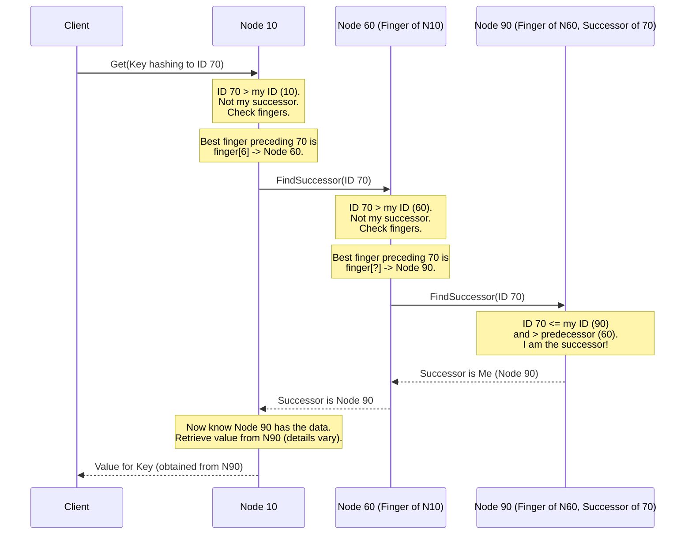

# Chapter 4: Routing & Data Location (Finger Table / Successor List)

Welcome back! In [Chapter 3: Chord Protocol & Ring](03_chord_protocol___ring_.md), we discovered how `pikachu` nodes organize themselves into a logical ring based on their IDs. We learned that each node is responsible for storing data keys whose IDs fall between its predecessor and itself, and that every node knows its immediate neighbor (its **successor**).

But imagine a huge Chord ring with millions of nodes. If Node 10 needs to find the node responsible for Key ID 5,000,000, simply asking its successor (say, Node 12), which asks its successor (Node 15), and so on, would take a *very* long time! It's like trying to walk from New York to Los Angeles using only local street signs – you'll get there eventually, but it's incredibly inefficient.

## The Problem: Finding Nodes Quickly

How can a [Node](02_node_.md) efficiently find the correct node responsible for a specific key ID, especially when that node might be far away on the Chord ring? We need a way to take "shortcuts" or "highways" across the ring.

**Use Case:** Let's say you connect to Node 10 (running on port 8001) and ask it to retrieve (`get`) the value for the key `"rare_candy_location"`.

```bash
# Assuming hash("rare_candy_location") = ID 5,000,000
# And Node 5,000,015 is responsible for this ID.
# Our ring has millions of nodes.
cargo run get -p 8001 -k "rare_candy_location"
```

Node 10 knows it's not responsible for ID 5,000,000. How does it quickly find Node 5,000,015 without asking thousands or millions of nodes one by one?

## The Solution: Shortcuts and Neighbors

Chord provides two key mechanisms to solve this:

1.  **Successor List:** Keeping track of immediate neighbors.
2.  **Finger Table:** Keeping track of nodes at exponentially increasing distances (shortcuts).

Let's look at each.

### 1. Successor List: Knowing Your Neighbors

Just knowing your single immediate successor (the next node clockwise) is a bit fragile. What if that successor node crashes right when you need to talk to it?

To add resilience, each node in `pikachu` (and Chord) typically keeps track of not just its immediate successor, but a small list of the next few nodes clockwise on the ring. This is the **Successor List**.

*   **Purpose:** Fault tolerance. If the primary successor is unavailable, the node can try the next one in the list.
*   **Size:** Usually small (e.g., 3-5 nodes). In `pikachu`, this size (`r`) is fixed (see `README.md`).
*   **Usage:** Primarily used for maintaining the ring structure during [Network Joining & Stabilization](06_network_joining___stabilization_.md) and as a fallback if the main successor fails during a lookup.

```mermaid
graph TD
    subgraph Ring with Successor List (Node 10's view)
        direction CLOCKWISE
        N10(Node 10<br>Successors: [35, 60, 90]) --> N35(Node 35)
        N35 --> N60(Node 60)
        N60 --> N90(Node 90)
        N90 --> N10
    end

    style N10 fill:#f9d,stroke:#333,stroke-width:2px
    style N35 fill:#ccf,stroke:#333,stroke-width:2px
    style N60 fill:#dfd,stroke:#333,stroke-width:2px
    style N90 fill:#fec,stroke:#333,stroke-width:2px
```

While the successor list helps with reliability for immediate neighbors, it doesn't solve the speed problem for finding distant nodes. That's where the finger table comes in.

### 2. Finger Table: The Highway System

The **Finger Table** is the clever mechanism Chord uses for fast routing. Think of it as a set of "highway signs" that point to nodes much further away on the ring.

Each node maintains a small table (the finger table) containing the network addresses (IP address and port) of other nodes located at specific, exponentially increasing distances around the ring.

**How it Works:**

*   **Entries:** A finger table has multiple entries (fingers). Let's say the total number of possible IDs is 2<sup>m</sup> (for an m-bit hash). The finger table typically has `m` entries.
*   **Target IDs:** The *i*-th entry in the finger table for a node `n` aims to point to the **successor** of the ID calculated as `(n + 2^(i-1)) mod 2^m`.
    *   `finger[1]` points to the successor of `n + 1` (usually the node's actual successor).
    *   `finger[2]` points to the successor of `n + 2`.
    *   `finger[3]` points to the successor of `n + 4`.
    *   `finger[4]` points to the successor of `n + 8`.
    *   ...and so on, doubling the distance each time.
*   **Shortcuts:** Each finger entry acts like a shortcut. The further down the table you go, the bigger the jump across the ring.

**Analogy: Highway Signs and Local Streets**

Imagine you're at address 10 on a circular road (the Chord Ring) with 100 addresses (0-99).

*   **Successor List:** You know the addresses 11, 12, 13 (local street signs). Good for finding address 11.
*   **Finger Table:** You also have signs pointing towards:
    *   The node responsible for address `10 + 1 = 11` (like the first street sign)
    *   The node responsible for address `10 + 2 = 12` (another nearby sign)
    *   The node responsible for address `10 + 4 = 14` (a slightly bigger jump)
    *   The node responsible for address `10 + 8 = 18`
    *   The node responsible for address `10 + 16 = 26`
    *   The node responsible for address `10 + 32 = 42` (a highway sign)
    *   The node responsible for address `10 + 64 = 74` (wraps around, so 74) (another highway sign)

If you need to find address 70:
1.  You look at your finger table (highway signs). The sign for `10 + 64 = 74` points to a node (say, Node 75) that's *past* 70, but the sign for `10 + 32 = 42` points to Node 45, which is *before* 70.
2.  You choose the "highway" sign that gets you closest *without overshooting* your target ID 70. That's the finger pointing towards Node 45 (for ID 42).
3.  You jump (electronically!) to Node 45.
4.  Node 45 repeats the process: it looks at *its* finger table to find the best jump towards ID 70. Maybe its finger for `45 + 16 = 61` points to Node 65. It jumps there.
5.  Node 65 repeats: Its finger for `65 + 4 = 69` points to Node 72. It jumps there.
6.  Node 72 repeats: Its finger for `72 + 1 = 73` points to Node 75. Its direct successor might be Node 75 too. It realizes 70 falls between its predecessor and itself (or its successor). It finds the responsible node (maybe itself or its direct successor).

Instead of 60 individual hops (10 -> 11 -> ... -> 70), we took just 3 hops (10 -> 45 -> 65 -> 72) using the finger table shortcuts! In a large network, this reduces the number of hops needed from potentially linear (N) to logarithmic (log N), which is *much* faster.

```mermaid
graph TD
    subgraph Chord Ring with Finger Table (Node 10's view)
        direction CLOCKWISE
        N10(Node 10) --> N35(Node 35)
        N35 --> N60(Node 60)
        N60 --> N90(Node 90)
        N90 --> N10

        subgraph "Node 10's Fingers"
            N10 -- "finger[1] (n+1)" --> N35
            N10 -- "finger[2] (n+2)" --> N35
            N10 -- "finger[3] (n+4)" --> N35
            N10 -- "finger[4] (n+8)" --> N35
            N10 -- "finger[5] (n+16)" --> N35
            N10 -- "finger[6] (n+32)" --> N60
            N10 -- "finger[7] (n+64)" ---> N90
        end
    end

    style N10 fill:#f9d,stroke:#333,stroke-width:4px
    style N35 fill:#ccf,stroke:#333,stroke-width:2px
    style N60 fill:#dfd,stroke:#333,stroke-width:2px
    style N90 fill:#fec,stroke:#333,stroke-width:2px

    linkStyle 0 stroke:#aaa,stroke-width:1px;
    linkStyle 1 stroke:#aaa,stroke-width:1px;
    linkStyle 2 stroke:#aaa,stroke-width:1px;
    linkStyle 3 stroke:#aaa,stroke-width:1px;

    linkStyle 4 stroke:#f00,stroke-width:2px,stroke-dasharray: 5 5;
    linkStyle 5 stroke:#f00,stroke-width:2px,stroke-dasharray: 5 5;
    linkStyle 6 stroke:#f00,stroke-width:2px,stroke-dasharray: 5 5;
    linkStyle 7 stroke:#f00,stroke-width:2px,stroke-dasharray: 5 5;
    linkStyle 8 stroke:#f00,stroke-width:2px,stroke-dasharray: 5 5;
    linkStyle 9 stroke:#f00,stroke-width:2px,stroke-dasharray: 5 5;
    linkStyle 10 stroke:#f00,stroke-width:2px,stroke-dasharray: 5 5;


```
*(Note: In this small example, many fingers point to the same node (35). In a larger ring, they would point to different, more distant nodes.)*

## Using Routing in `pikachu`

You, as the user, don't directly manipulate the finger table or successor list. You just use the `put` and `get` commands. The node you connect to uses its internal routing tables (successor list and finger table) automatically to find the correct destination for your request.

```bash
# Ask Node 10 (port 8001) to get the value for Key ID 70
# Assume Node 90 is responsible for ID 70 in our 4-node example.
cargo run get -p 8001 -k "some_key_that_hashes_to_70"
```

**What happens conceptually:**

1.  Your command contacts Node 10.
2.  Node 10 hashes the key to get ID 70.
3.  Node 10 checks: Is 70 between my predecessor (90) and me (10)? No.
4.  Node 10 consults its finger table (see diagram above). It looks for the finger pointing furthest around the ring *without going past* 70.
    *   `finger[7]` target is `10+64=74`. Successor is Node 90. This is *past* 70 (or equal, depends on definition).
    *   `finger[6]` target is `10+32=42`. Successor is Node 60. This is *before* 70. This looks like the best jump!
5.  Node 10 forwards the request ("find successor of 70") to the node in `finger[6]`, which is Node 60.
6.  Node 60 receives the request for ID 70. It checks: Is 70 between my predecessor (35) and me (60)? No.
7.  Node 60 consults *its* finger table. Let's say its finger for `60+8=68` points to Node 90. This is the best jump without overshooting 70.
8.  Node 60 forwards the request to Node 90.
9.  Node 90 receives the request for ID 70. It checks: Is 70 between my predecessor (60) and me (90)? Yes!
10. Node 90 knows it is responsible for ID 70. It looks up the key locally and finds the value.
11. Node 90 sends the value back (how this happens depends on the lookup type, see [Recursive Lookup](05_recursive_lookup_.md)). Eventually, the value gets back to Node 10, which returns it to your command.

This process of nodes using their finger tables to hop closer and closer to the target ID is the core of efficient routing in Chord.

## Internal Implementation: Finding the Successor

Let's peek "under the hood" at how a node might use its tables to find the successor of an ID. This logic is central to both `put` and `get` operations.

**High-Level Walkthrough:**

When a node (let's call it `currentNode`) receives a request to find the node responsible for `targetId`:

1.  **Check Successor:** `currentNode` first checks if `targetId` falls between its own ID and its immediate successor's ID. If yes, the successor is the answer.
2.  **Consult Finger Table:** If not, `currentNode` iterates through its finger table from the furthest finger (largest jump) down to the closest (smallest jump).
3.  **Find Best Finger:** It looks for the highest finger `f` whose node (`f.node`) comes *before* `targetId` in the ring ordering. This is the best shortcut to take.
4.  **Forward Request:** `currentNode` asks the node identified by that best finger (`f.node`) to continue the search for `targetId`. (This forwarding is part of the [Recursive Lookup](05_recursive_lookup_.md) process).

**Sequence Diagram Example (Finding Successor of ID 70, starting at Node 10):**



**Code Sneak Peek (Conceptual):**

Inside a node's logic (conceptually similar to what might be in `src/node.rs` or `src/service.rs` when handling lookups), the core routing decision looks something like this:

```rust
// Simplified pseudo-code, not exact pikachu code
fn find_best_node_to_ask(local_node_id: u64, target_id: u64, finger_table: &FingerTable, successor: &NodeInfo) -> NodeInfo {

    // Check if the immediate successor is responsible
    if is_id_between(target_id, local_node_id, successor.id) {
        return successor.clone(); // Ask the successor
    }

    // Check fingers from furthest to closest
    for i in (0..finger_table.len()).rev() {
        let finger_node = &finger_table[i].node;
        // If this finger is closer to the target_id *without* overshooting
        if is_id_between(finger_node.id, local_node_id, target_id) {
             // Ask this finger node to continue the search
            return finger_node.clone();
        }
    }

    // If no finger is better, ask the direct successor
    return successor.clone();
}

// --- Helper function (conceptual) ---
// Checks if id is in the range (start, end] on the ring
fn is_id_between(id: u64, start: u64, end: u64) -> bool {
    if start < end {
        id > start && id <= end
    } else { // Handle wrap-around
        id > start || id <= end
    }
}
```

This simplified logic shows how the node uses its finger table (`finger_table`) and its knowledge of its successor (`successor`) to decide which *next* node to contact in the search for `targetId`. The actual implementation involves gRPC calls between nodes and handling the responses, which is part of the [Recursive Lookup](05_recursive_lookup_.md) mechanism. The finger table itself is periodically updated through the [Network Joining & Stabilization](06_network_joining___stabilization_.md) process.

## Conclusion

You've now learned how `pikachu` nodes find data efficiently in the large Chord ring!

*   **Successor Lists:** Provide fault tolerance for immediate neighbors.
*   **Finger Tables:** Provide logarithmic-time routing performance by creating "shortcuts" across the ring using exponentially increasing distances.

These tables are the "maps and highway signs" of the DHT. They allow any node to quickly determine the next hop towards the node responsible for any given key ID, making operations like `put` and `get` fast even in very large networks.

We saw *what* information nodes use (the tables) and *why* it's structured that way (efficiency). But how exactly do nodes use this information step-by-step to guarantee they find the right place? That process is called **lookup**.

**Next:** [Chapter 5: Recursive Lookup](05_recursive_lookup_.md)