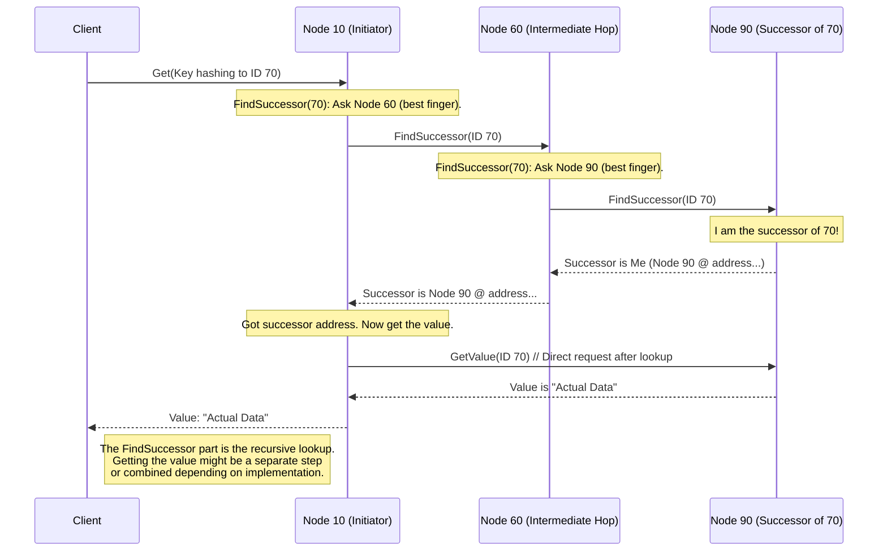

# Chapter 5: Recursive Lookup

Welcome back! In [Chapter 4: Routing & Data Location (Finger Table / Successor List)](04_routing___data_location__finger_table___successor_list__.md), we learned how each `pikachu` node keeps a special address book: a **Successor List** for its immediate neighbors and a **Finger Table** for nodes further away, acting like highway signs on the [Chord Protocol & Ring](03_chord_protocol___ring_.md). These tables give nodes the *potential* to find data quickly.

But just having the map and signs isn't enough. How does a node *actually use* this information to find the final destination for a piece of data? What's the step-by-step strategy? That's where **Recursive Lookup** comes in.

## The Problem: The Journey, Not Just the Map

Imagine you're in a new city (the Chord ring) and need to get to a specific landmark (the node responsible for a certain Key ID). You have a map with some major highway signs (the Finger Table), but you don't necessarily know the *exact* route from start to finish just by looking at it once.

**Use Case:** Let's say you connect to Node A and ask it to `get` the value for a key like `"legendary_pokemon_location"`. Node A hashes the key and finds its target ID is `T`, which is very far away on the ring. Node A looks at its finger table but doesn't see an entry pointing *directly* to the node responsible for `T`. How does Node A reliably find that destination node without getting lost or asking everyone?

## The Solution: Asking for Directions, Step-by-Step (Recursively)

`pikachu` uses a strategy called **Recursive Lookup** to find the node responsible for a key ID. It's like asking for directions progressively:

1.  **Ask Locally:** When a node (say, Node A) needs to find the node responsible for a target ID `T` (the *successor* of `T`), it first checks if *it* is the responsible node or if its immediate successor is responsible.
2.  **Find Best Next Step:** If not, Node A looks at its finger table. It finds the node in its finger table that is *closest* to the target ID `T` **without going past it** (this is the "best highway sign" we saw in Chapter 4). Let's say this points to Node B.
3.  **Forward the Question:** Node A then sends the lookup request (e.g., "Who is responsible for ID `T`?") directly to Node B. Node A essentially says, "I don't know the final answer, but you seem closer. Can you figure it out from here?"
4.  **Repeat the Process:** Node B receives the request. It performs the *exact same steps*:
    *   Check if *it* or its successor is responsible for `T`.
    *   If not, consult *its own* finger table to find the best node *it* knows (say, Node C) that is closer to `T` without going past it.
    *   Forward the request to Node C.
5.  **Continue Hopping:** This process repeats. Each node forwards the request to the next node that it believes is closest to the target ID, based on its local finger table information. The request hops from node to node, getting progressively closer to the destination in the ID space.
6.  **Found It!:** Eventually, the request reaches a node (say, Node Z) that realizes either *it* is the successor of `T` or its immediate successor is. Node Z now knows the final answer (the address of the node responsible for `T`).
7.  **Return the Answer:** Node Z sends the answer (the address of the responsible node) back to the node that asked *it* (e.g., Node Y). Node Y then sends the answer back to the node that asked *it*, and so on. The answer travels back along the same path the request took, until it reaches the original node (Node A).
8.  **Final Result:** Node A receives the address of the responsible node (Node Z). Now Node A can interact with Node Z directly if needed (e.g., to get the actual value if it was a `get` request, or to tell it to store the data if it was a `put`). Node A then sends the final result (the value or a success message) back to the user who made the initial request.

**Analogy: Progressive Directions**

Imagine asking for directions to a specific small shop downtown:
*   You ask someone (Node A): "Where is 'Zapdos Zappers' shop?"
*   They say: "I don't know exactly, but head towards the Main Street interchange (Node B). Ask someone there." (Node A forwards request to Node B)
*   You get to Main Street interchange (Node B) and ask again.
*   They say: "Okay, now go down Elm Street (Node C)." (Node B forwards request to Node C)
*   You get to Elm Street (Node C) and ask again.
*   They say: "Ah, Zapdos Zappers (Node Z)! It's right next door. I'm the owner!" (Node C forwards to Node Z; Node Z realizes it's the destination).
*   Node Z tells Node C: "The shop is here at address 123."
*   Node C tells Node B: "The shop is at address 123."
*   Node B tells Node A: "The shop is at address 123."
*   Node A tells you: "The shop is at address 123."

Notice how the *question* ("Where is the shop?") travels forward hop-by-hop, and the *answer* ("It's at address 123") travels backward along the same path. This is recursive lookup!

## How Recursive Lookup Solves the Use Case

Let's revisit our `get` request for `"legendary_pokemon_location"` (target ID `T`) sent to Node A.

1.  **Client -> Node A:** `get("legendary_pokemon_location")`
2.  **Node A:** Calculates hash ID `T`. Checks its own responsibility and successor. No match. Consults finger table, finds Node B is the closest preceding node to `T`.
3.  **Node A -> Node B:** Sends a `FindSuccessor(T)` request.
4.  **Node B:** Receives request. Checks self/successor. No match. Consults *its* finger table, finds Node C is the closest preceding node.
5.  **Node B -> Node C:** Sends `FindSuccessor(T)` request.
6.  **(Repeat...)** This continues, maybe through Node D, Node E...
7.  **Node Y -> Node Z:** Sends `FindSuccessor(T)` request.
8.  **Node Z:** Receives request. Checks self/successor. Finds that *it* is indeed the successor of `T`! It knows it is responsible for storing data with ID `T`.
9.  **Node Z -> Node Y:** Sends response: "The successor of `T` is me, Node Z (address...)."
10. **Node Y -> ... -> Node C -> Node B:** Response travels back up the chain.
11. **Node B -> Node A:** Sends response: "The successor of `T` is Node Z (address...)."
12. **Node A:** Receives the final answer. Now Node A knows Node Z is the place to get the data. Node A might then contact Node Z directly to ask for the value associated with `"legendary_pokemon_location"`. Once Node A gets the value, it sends it back to the client.
13. **Node A -> Client:** Returns the value (e.g., `"Cerulean Cave"`).

The recursive lookup efficiently found the responsible node (Node Z) in a logarithmic number of hops, thanks to the finger tables guiding the way.

## Internal Implementation: Following the Chain

Let's visualize the recursive lookup process for finding the successor of ID 70, starting at Node 10 in our 4-node ring (Nodes 10, 35, 60, 90). Remember from Chapter 4, Node 90 is responsible for ID 70.

**Walkthrough:**

1.  **Start at Node 10:** Request for successor of 70 arrives. Node 10 isn't responsible. Best finger preceding 70 points to Node 60.
2.  **Forward to Node 60:** Node 10 sends `FindSuccessor(70)` to Node 60.
3.  **At Node 60:** Request arrives. Node 60 isn't responsible. Best finger preceding 70 points to Node 90.
4.  **Forward to Node 90:** Node 60 sends `FindSuccessor(70)` to Node 90.
5.  **At Node 90:** Request arrives. Node 90 *is* responsible for ID 70 (it's between its predecessor 60 and itself 90). Node 90 is the successor.
6.  **Response from Node 90:** Node 90 sends the result ("Successor is Node 90") back to Node 60 (who asked it).
7.  **Response from Node 60:** Node 60 receives the result and sends it back to Node 10 (who asked it).
8.  **Node 10 has the answer:** Node 10 now knows Node 90 is the successor.

**Sequence Diagram:**



*(Note: In some implementations, the value might be returned directly along the recursive path instead of Node A making a second request.)*

**Code Sneak Peek (Conceptual):**

The core logic often lives where incoming RPCs (Remote Procedure Calls) are handled, like in `src/service.rs`. When a node receives a `FindSuccessor` request:

```rust
// Simplified pseudo-code, not exact pikachu code
// Represents handling a FindSuccessor request received via gRPC

async fn handle_find_successor_request(request: FindSuccessorRequest, local_node: &NodeState) -> FindSuccessorResponse {
    let target_id = request.target_id;
    let requester_address = request.requester_address; // Who originally asked

    // 1. Check if my successor is responsible
    let my_id = local_node.id;
    let successor = local_node.get_successor(); // Get from Successor List

    // Check if target_id is between me and my successor
    if is_id_between(target_id, my_id, successor.id) {
        // My successor is the answer! Return its info.
        return FindSuccessorResponse {
            successor_node_info: successor.clone(),
        };
    } else {
        // 2. Not my successor. Find the best finger to forward to.
        let next_hop_node = local_node.find_closest_preceding_node(target_id); // Uses Finger Table

        // 3. Forward the request *recursively* to that next hop node.
        // This involves making a *new* gRPC call from this node to the next_hop_node.
        println!(
            "Node {}: Forwarding FindSuccessor({}) to Node {}",
            my_id, target_id, next_hop_node.id
        );
        match call_find_successor_on_other_node(next_hop_node.address, target_id).await {
            Ok(response_from_next_hop) => {
                // 4. Return the response we got from the recursive call
                return response_from_next_hop;
            }
            Err(e) => {
                // Handle error (e.g., next hop didn't respond)
                eprintln!("Error forwarding request: {}", e);
                // Return an error response
                return FindSuccessorResponse { /* Indicate error */ };
            }
        }
    }
}

// Helper function mentioned in Chapter 4
fn is_id_between(id: u64, start: u64, end: u64) -> bool {
    // ... logic to handle wrapping around the ID circle ...
    if start < end { id > start && id <= end } else { id > start || id <= end }
}

// Placeholder for the function that finds the best finger node
impl NodeState {
    fn find_closest_preceding_node(&self, target_id: u64) -> NodeInfo {
        // Logic using self.finger_table as seen in Chapter 4
        // ... iterate fingers backwards, find best preceding node ...
        // Returns the NodeInfo (ID + address) of the best node to ask next.
        unimplemented!()
    }
     fn get_successor(&self) -> NodeInfo {
        // Logic to get the first entry from the successor list
        unimplemented!()
     }
}

// Placeholder for making the actual gRPC call
async fn call_find_successor_on_other_node(
    address: String,
    target_id: u64,
) -> Result<FindSuccessorResponse, Error> {
    // ... Connect to 'address' via gRPC and call its FindSuccessor method ...
    unimplemented!()
}
```

This conceptual code shows the core decision: either the current node's successor is the answer, or the node finds the best next hop using its [Routing & Data Location (Finger Table / Successor List)](04_routing___data_location__finger_table___successor_list__.md) and *recursively* calls `FindSuccessor` on that next node. The response from that recursive call is then passed back up the chain.

## Conclusion

You've now learned about **Recursive Lookup**, the step-by-step strategy `pikachu` uses to navigate the Chord ring and find the node responsible for any given key ID.

*   It works by forwarding the request hop-by-hop.
*   Each node uses its local [Routing & Data Location (Finger Table / Successor List)](04_routing___data_location__finger_table___successor_list__.md) to find the best next hop closer to the target ID.
*   The process is efficient (logarithmic hops) because finger tables provide shortcuts.
*   The answer travels back along the path the request took.

This lookup mechanism relies heavily on the successor lists and finger tables being accurate and up-to-date. But what happens when new nodes join the network or existing nodes leave? How do these tables get updated correctly to keep the DHT working? That's the topic of our next chapter!

**Next:** [Chapter 6: Network Joining & Stabilization](06_network_joining___stabilization__.md)
