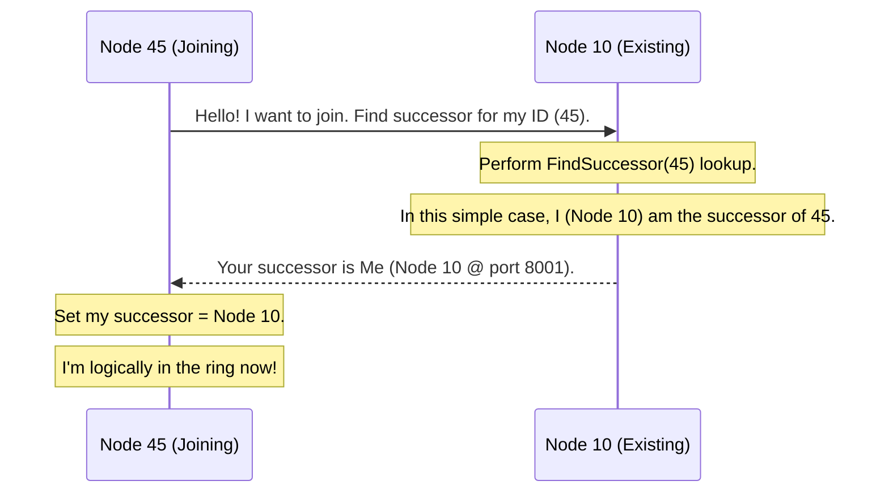
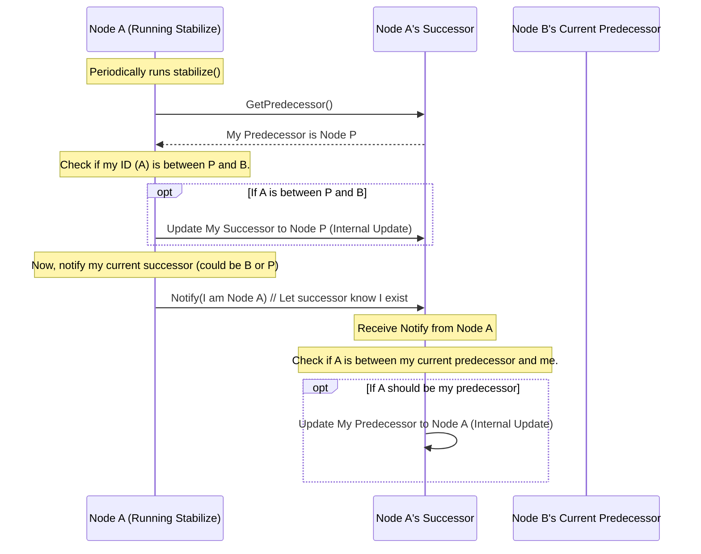

# Chapter 6: Network Joining & Stabilization

Hello again! In [Chapter 5: Recursive Lookup](05_recursive_lookup_.md), we saw the clever step-by-step process nodes use, relying on their finger tables and successors, to find the exact [Node](02_node_.md) responsible for a piece of data within the [Chord Protocol & Ring](03_chord_protocol___ring_.md). This lookup process is incredibly powerful, but it depends on one crucial assumption: that the nodes' routing information (their successor lists and finger tables) is *correct* and *up-to-date*.

But what happens when the network changes? Nodes aren't static; new ones can join at any time. How does a brand-new node get added to the ring, and how does the rest of the network update its information to include this newcomer?

## The Problem: Keeping the Library Organized as Staff Changes

Imagine our giant circular library from previous chapters. The librarians ([Node](02_node_.md)s) have their assigned sections and contact lists ([Routing & Data Location (Finger Table / Successor List)](04_routing___data_location__finger_table___successor_list__.md)) to help people find books quickly ([Recursive Lookup](05_recursive_lookup_.md)).

Now, what happens when:
1.  **A New Librarian Arrives:** How do they figure out which section they are responsible for? How do the *other* librarians update their contact lists and section assignments to include this new person?
2.  **Dynamic Environment:** Even without new librarians, maybe someone's phone number changes, or they temporarily swap sections. How does everyone keep their internal contact lists accurate over time?

If the librarians don't update their information when things change, the whole system breaks down. They might send people to the wrong section or try to contact librarians who are no longer there. Our `pikachu` DHT faces the same challenge.

## The Solution: Joining Procedures and Periodic Check-ups

Chord (and `pikachu`) handles these dynamic changes through two main processes:

1.  **Network Joining:** A defined procedure for a new node to integrate itself into the existing Chord ring.
2.  **Stabilization:** A set of periodic background tasks that *all* nodes run constantly to verify and update their local routing information (successor, predecessor, fingers), ensuring the network adapts to changes and maintains correctness.

Let's explore how these work.

### 1. Network Joining: Welcome to the Ring!

When you start a new `pikachu` node and want it to join an *existing* network, you use the `join` command, telling it the address of at least one node already in the network (a **bootstrap node**).

**Use Case:** We have a network running with just one node (Node 10 on port 8001). Now, we want to add Node 45 (on port 8002).

```bash
# Start the second node, telling it to join via the node at port 8001
cargo run join -b 8001 -p 8002
```

*   `-b 8001`: Specifies the bootstrap node's port.
*   `-p 8002`: Specifies the port for the *new* node (Node 45).

**What happens when Node 45 tries to join?**

1.  **Assign ID:** Node 45 starts up and gets its own unique ID (e.g., 45) by hashing its address (127.0.0.1:8002).
2.  **Contact Bootstrap:** Node 45 contacts the bootstrap node (Node 10 @ port 8001).
3.  **Find Successor:** Node 45 asks Node 10: "Using the [Recursive Lookup](05_recursive_lookup_.md) mechanism, please find the node that should be my successor (the node responsible for ID 45)."
4.  **Lookup:** Node 10 performs a lookup for ID 45. In our simple example, Node 10 is the only node, so it knows *it* is currently responsible for all IDs, including 45. It replies to Node 45, "Your successor is Node 10 @ port 8001".
5.  **Initialize Successor:** Node 45 sets its successor pointer to Node 10.
6.  **Join the Ring:** At this point, Node 45 considers itself part of the ring. It knows its immediate successor.



**Initial State:** Node 45 has joined, but the ring information is still incomplete and potentially inconsistent. Node 45 knows its successor (Node 10), but Node 10 doesn't yet know about Node 45, and neither node knows its correct predecessor yet. Finger tables also need to be built. This is where stabilization comes in.

### 2. Stabilization: Keeping the Ring Healthy

Joining gets a node *into* the ring conceptually, but **Stabilization** is the continuous process that makes the ring structure correct and keeps it that way over time. Think of it as a set of background chores each node performs periodically (e.g., every few seconds).

`pikachu` nodes perform several stabilization tasks:

*   **`stabilize()`:** Verifies and updates the node's immediate **successor**. It also notifies its successor that it exists, potentially updating the successor's predecessor.
*   **`notify()`:** A helper call used by `stabilize`. When Node A runs `stabilize`, it asks its successor (Node B) for *its* predecessor (Node P). If Node A thinks *it* should be Node B's predecessor instead of Node P (because Node A's ID is between P and B), Node A calls `notify(A)` on Node B. Node B then checks if A is indeed its correct predecessor and updates if necessary.
*   **`check_predecessor()`:** Periodically checks if the node's current predecessor is still alive and responding. If not, the predecessor pointer is cleared.
*   **`fix_fingers()`:** Periodically picks one entry in the [Routing & Data Location (Finger Table / Successor List)](04_routing___data_location__finger_table___successor_list__.md) and re-runs the [Recursive Lookup](05_recursive_lookup_.md) for that finger's target ID to ensure the pointer is still correct. This gradually corrects the entire finger table over time.

**How Stabilization Completes the Join:**

Let's continue our example after Node 45 initially joined:

*   **Initial State:**
    *   Node 10: Successor=10, Predecessor=nil
    *   Node 45: Successor=10, Predecessor=nil

*   **Node 45 runs `stabilize()`:**
    1.  Asks its successor (Node 10) for *its* predecessor. Node 10 currently has no predecessor (nil).
    2.  Node 45 checks if its ID (45) falls between Node 10's predecessor (nil) and Node 10. Yes, it does (conceptually, IDs wrap around).
    3.  Node 45 believes it should be Node 10's predecessor. It calls `notify(Node 45)` on Node 10.
*   **Node 10 receives `notify(Node 45)`:**
    1.  Node 10 checks: Is my current predecessor (nil) set? Or is Node 45's ID (45) between my current predecessor (nil) and my ID (10)? Yes.
    2.  Node 10 updates its predecessor pointer to Node 45.
*   **Node 10 runs `stabilize()`:**
    1.  Asks its successor (which it still thinks is itself, Node 10) for *its* predecessor (which is now Node 45). Let's call this potential new successor `x = Node 45`.
    2.  Checks if `x` (Node 45) has an ID between Node 10's ID and Node 10's current successor's ID (which is also Node 10). Yes, 45 is between 10 and 10 (in the circular sense).
    3.  Node 10 updates its successor to Node 45.
    4.  Node 10 now needs to notify its *new* successor (Node 45). It calls `notify(Node 10)` on Node 45.
*   **Node 45 receives `notify(Node 10)`:**
    1.  Node 45 checks: Is my current predecessor (nil) set? Or is Node 10's ID (10) between my current predecessor (nil) and my ID (45)? Yes.
    2.  Node 45 updates its predecessor to Node 10.

*   **Later `fix_fingers()` runs on both nodes:** They will gradually re-calculate their finger table entries by performing lookups, discovering each other, and populating their tables correctly.

**Final Stabilized State:**

*   Node 10: Successor=45, Predecessor=45
*   Node 45: Successor=10, Predecessor=10
*   Both nodes' finger tables will eventually point correctly (mostly to each other in this small example).

```mermaid
graph TD
    subgraph Chord Ring after Stabilization
        direction CLOCKWISE
        N10(Node 10<br>S: 45, P: 45) --> N45(Node 45<br>S: 10, P: 10)
        N45 --> N10
    end

    style N10 fill:#f9d,stroke:#333,stroke-width:2px
    style N45 fill:#ccf,stroke:#333,stroke-width:2px
```

This stabilization process happens continuously in the background for *all* nodes, not just new ones. It ensures that even if multiple nodes join or the network topology changes, the successor, predecessor, and finger table pointers eventually converge to the correct state, keeping the DHT routing reliable.

**(Important Note:** `pikachu` doesn't handle node *failures* gracefully. If a node crashes, stabilization might help route around it eventually, but data stored on the failed node could be lost, and lookups might fail temporarily. Real-world DHTs often add data replication for fault tolerance, which is not implemented in `pikachu`.)

## Internal Implementation: Background Tasks

Stabilization isn't triggered by a user command; it runs automatically within each `pikachu` node. This is typically implemented using asynchronous tasks that run periodically.

**Conceptual Code Snippets (Background Tasks):**

Inside the main loop or task scheduler of a node (e.g., in `src/node.rs` or `src/main.rs` where the node tasks are managed):

```rust
// Simplified pseudo-code, not exact pikachu code

async fn run_background_tasks(node_state: Arc<NodeState>) {
    let mut interval = tokio::time::interval(Duration::from_secs(5)); // Run every 5 seconds

    loop {
        interval.tick().await; // Wait for the next interval

        // --- Run Stabilization Tasks ---
        let state = node_state.clone();
        tokio::spawn(async move {
            stabilize_successor(&state).await;
        });

        let state = node_state.clone();
        tokio::spawn(async move {
            fix_random_finger(&state).await;
        });

         let state = node_state.clone();
        tokio::spawn(async move {
            check_predecessor_health(&state).await;
        });
    }
}

// --- Conceptual Task Functions ---

async fn stabilize_successor(node_state: &NodeState) {
    // 1. Get current successor (s)
    // 2. Ask 's' for its predecessor (p) using RPC call
    // 3. If 'p' is between node_state.id and s.id:
    //      Update node_state's successor to 'p'
    // 4. Get updated successor (s_new)
    // 5. Call notify(my_node_info) on s_new using RPC call
    println!("Running stabilize...");
    // ... actual RPC calls and logic ...
}

async fn fix_random_finger(node_state: &NodeState) {
    // 1. Pick a random index 'i' for the finger table
    // 2. Calculate target_id = (node_state.id + 2^(i-1)) mod ring_size
    // 3. Perform FindSuccessor(target_id) lookup (using recursive lookup)
    // 4. Update finger_table[i] with the result
    println!("Running fix_fingers...");
    // ... actual RPC calls and logic ...
}

async fn check_predecessor_health(node_state: &NodeState) {
    // 1. Get current predecessor (p)
    // 2. If p is not nil:
    //      Send a simple "ping" RPC call to p
    //      If ping fails:
    //          Clear predecessor pointer in node_state
    println!("Running check_predecessor...");
    // ... actual RPC calls and logic ...
}
```

This pseudo-code illustrates how background tasks might be scheduled using `tokio` timers. Each task (`stabilize_successor`, `fix_random_finger`, `check_predecessor_health`) would contain the logic described earlier, involving RPC calls (like `find_successor`, `get_predecessor`, `notify`, `ping`) to communicate with other nodes and update the local `NodeState`. The actual implementation details can be found in files like `src/tasks.rs`, `src/node.rs`, and `src/service.rs`.

The `stabilize` and `notify` interactions are key to maintaining the core ring structure:



This continuous cycle of checking and notifying ensures that the successor and predecessor pointers remain accurate even as nodes join the network. `fix_fingers` similarly ensures the finger tables eventually become correct.

## Conclusion

You've reached the end of our `pikachu` tutorial journey! In this final chapter, we explored how the DHT network stays dynamic and organized:

*   **Network Joining:** New nodes use a bootstrap node and the [Recursive Lookup](05_recursive_lookup_.md) mechanism (`FindSuccessor`) to find their initial place in the [Chord Protocol & Ring](03_chord_protocol___ring_.md) and set their successor.
*   **Stabilization:** Continuous, periodic background tasks (`stabilize`, `notify`, `check_predecessor`, `fix_fingers`) run on all nodes to:
    *   Verify and correct successor/predecessor links.
    *   Keep the [Routing & Data Location (Finger Table / Successor List)](04_routing___data_location__finger_table___successor_list__.md) up-to-date.
    *   Ensure the network adapts to changes (primarily nodes joining in `pikachu`).

These processes are essential for the long-term health and correctness of the DHT, allowing it to function reliably even as its participants change over time.

We hope this tutorial has given you a clear, beginner-friendly understanding of the core concepts behind Distributed Hash Tables and the `pikachu` implementation, from the basic idea of distributing data to the intricate details of routing and network maintenance. Happy coding!
